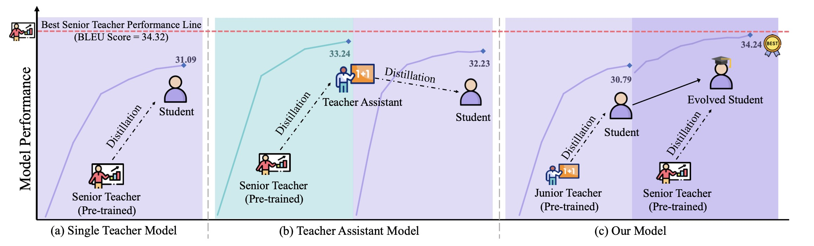

# Evolving Knowledge Distillation for Lightweight Neural Machine Translation

Recent advancements in Neural Machine Trans- lation (NMT) have significantly improved translation quality. However, the increasing size and complexity of state-of-the-art models present significant challenges for deployment on resource- limited devices. Knowledge distillation (KD) is a promising approach for compressing models, but its effectiveness dimin- ishes when there is a large capacity gap between teacher and student models. To address this issue, we propose Evolving Knowledge Distillation (EKD), a progressive training framework in which the student model learns from a sequence of teachers with gradually increasing capacities. Experiments on IWSLT-14, WMT-17, and WMT-23 benchmarks show that EKD leads to consistent improvements at each stage. On IWSLT-14, the final student achieves a BLEU score of 34.24, narrowing the gap to the strongest teacher (34.32 BLEU) to just 0.08 BLEU. Similar trends are observed on other datasets. These results demonstrate that EKD effectively bridges the capacity gap, enabling compact models to achieve performance close to that of much larger teacher models.




# Requirements and Installation

* [PyTorch](http://pytorch.org/) version >= 1.10.0
* Python version = 3.8
* For training new models, you'll also need an NVIDIA GPU and [NCCL](https://github.com/NVIDIA/nccl)
* To install and develop locally:

``` bash
git clone https://github.com/pytorch/fairseq
cd fairseq
pip install --editable ./
pip install sacremoses
pip install sacrebleu==1.5.1

# on MacOS:
# CFLAGS="-stdlib=libc++" pip install --editable ./
```

## Data acquisition and processing
Here is an example of data acquisition and processing for the IWSLT 2014 (German-English) dataset. For the acquisition and processing of other datasets, you can refer to this example. 
``` bash
cd examples/translation/
bash prepare-iwslt14.sh
cd ../..
TEXT=examples/translation/iwslt14.tokenized.de-en
fairseq-preprocess --source-lang de --target-lang en \
    --trainpref $TEXT/train --validpref $TEXT/valid --testpref $TEXT/test \
    --destdir data-bin/iwslt14.tokenized.de-en
```


## Evolving Knowledge Distillation
We provide example commands for transformer_iwslt_de_en model. 


### Train base model on iwslt14-de-en dataset
train student model:
```bash
# default parameter
bash bin/student_model.sh
# manual parameter transmission
bash bin/student_model.sh ${SAVE_DIR} ${LOG_FILE} ${DATA_SET_DIR} ${MODEL} ${MAX_EPOCH}
```

train junior teacher model:
```bash
# default parameter
bash bin/junior_teacher.sh
# manual parameter transmission
bash bin/junior_teacher.sh ${SAVE_DIR} ${LOG_FILE} ${DATA_SET_DIR} ${MODEL} ${MAX_EPOCH}
```

train senior teacher model:
```bash
# default parameter
bash bin/senior_teacher.sh
# manual parameter transmission
bash bin/senior_teacher.sh ${SAVE_DIR} ${LOG_FILE} ${DATA_SET_DIR} ${MODEL} ${MAX_EPOCH}
```

### Distillation

train  junior student model:
```bash
# default parameter
bash bin/junior_student.sh
# manual parameter transmission
bash bin/junior_student.sh ${SAVE_DIR} ${LOG_FILE} ${DATA_SET_DIR} ${TEACHER_MODEL_PATH} ${MODEL} ${MAX_EPOCH}
```

train senior student model:
```bash
# default parameter
bash bin/senior_student.sh
# manual parameter transmission
bash bin/senior_student.sh ${SAVE_DIR} ${LOG_FILE} ${DATA_SET_DIR} ${TEACHER_MODEL_PATH} ${MODEL} ${MAX_EPOCH}
```

train master student model:
```bash
# default parameter
bash bin/master_student.sh
# manual parameter transmission
bash bin/master_student.sh ${SAVE_DIR} ${LOG_FILE} ${DATA_SET_DIR} ${JUNIOR_STUDENT_MODEL_PATH} ${TEACHER_MODEL_PATH} ${MODEL} ${MAX_EPOCH}
```

### Run Evaluation
```bash
# default parameter
bash bin/eval_model.sh
# manual parameter transmission
bash bin/eval_model.sh ${BEST_MODEL_PATH} ${LOG_FILE} ${DATA_SET_DIR}
```

## TAKD
### Train assistant teacher model on iwslt14-de-en dataset
train teacher model:
```bash
# default parameter
bash bin/TAKD_assistant_teacher.sh
# manual parameter transmission
bash bin/TAKD_assistant_teacher.sh ${SAVE_DIR} ${LOG_FILE} ${DATA_SET_DIR} ${TEACHER_MODEL_PATH} ${MODEL} ${MAX_EPOCH}
```

### Distillation
train student model:
```bash
# default parameter
bash bin/TAKD_student.sh
# manual parameter transmission
bash bin/TAKD_student.sh ${SAVE_DIR} ${LOG_FILE} ${DATA_SET_DIR} ${TEACHER_MODEL_PATH} ${MODEL} ${MAX_EPOCH}
```
