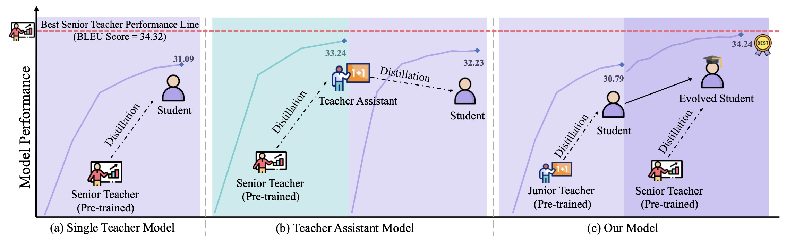

# Evolving Knowledge Distillation for Lightweight Neural Machine Translation

[](https://ieeexplore.ieee.org/abstract/document/11272633)
[](https://arxiv.org/abs/2605.09924)
[](https://opensource.org/licenses/MIT)

> **Xuewen Zhang, Haixiao Zhang, Xinlong Huang**
> Li Auto, Beijing, China
> *Accepted at ICTAI 2025*

## Overview

Recent state-of-the-art Neural Machine Translation (NMT) models are too large to deploy on resource-constrained devices. Knowledge distillation (KD) is a promising compression method, but its effectiveness drops significantly when there is a large capacity gap between teacher and student.

We propose **Evolving Knowledge Distillation (EKD)**, a progressive training framework where a single student model learns sequentially from a series of teacher models with **gradually increasing capacities** — analogous to how students progress through school levels before university.



**Key advantages over prior methods:**

| Method | IWSLT-14 BLEU | Gap to Teacher |
|---|---|---|
| Single Teacher (T_senior → S) | 31.09 | 3.23 (↓9.41%) |
| TAKD (T_senior → TA → S) | 32.23 | 2.09 (↓6.09%) |
| **EKD (Ours)** | **34.24** | **0.08 (↓0.23%)** |

## Main Results

BLEU and COMET scores across all three benchmarks:

| Model | IWSLT-14 De→En | | WMT-23 En→Cs | | WMT-17 En→De | |
|---|---|---|---|---|---|---|
| | BLEU | COMET | BLEU | COMET | BLEU | COMET |
| Student (S) | 28.54 | 0.71 | 11.51 | 0.44 | 11.46 | 0.42 |
| Junior Teacher (T_junior) | 32.78 | 0.75 | 16.00 | 0.50 | 16.90 | 0.47 |
| T_junior → S | 30.79 | 0.73 | 14.10 | 0.48 | 14.76 | 0.45 |
| Senior Teacher (T_senior) | 34.32 | — | 17.00 | — | 17.79 | — |
| **T_senior → [T_junior → S] (EKD)** | **34.24** | **0.77** | **16.24** | **0.51** | **17.41** | **0.48** |

## Model Configurations

| Model | Embed Dim | FFN Dim | Heads | Layers | Params (IWSLT) |
|---|---|---|---|---|---|
| Student (S) | 128 | 1024 | 4 | 6 | 6M |
| Junior Teacher (T_junior) | 256 | 1024 | 4 | 6 | 15M |
| Senior Teacher (T_senior) | 512 | 1024 | 4 | 6 | 39M |

## Requirements and Installation

- Python 3.8
- PyTorch >= 1.10.0
- NVIDIA GPU + [NCCL](https://github.com/NVIDIA/nccl) (for training)

```bash
git clone https://github.com/agi-content-generation/EKD
cd EKD
pip install --editable ./
pip install sacremoses
pip install sacrebleu==1.5.1

# On macOS:
# CFLAGS="-stdlib=libc++" pip install --editable ./
```

## Data Preparation

Below is an example for the **IWSLT-14 De→En** dataset. Other datasets follow the same pattern.

```bash
# Step 1: Download and tokenize
cd examples/translation/
bash prepare-iwslt14.sh
cd ../..

# Step 2: Binarize
TEXT=examples/translation/iwslt14.tokenized.de-en
fairseq-preprocess --source-lang de --target-lang en \
    --trainpref $TEXT/train \
    --validpref $TEXT/valid \
    --testpref $TEXT/test \
    --destdir data-bin/iwslt14.tokenized.de-en
```

## Training

EKD follows a **three-stage pipeline**. All scripts default to IWSLT-14 De→En and accept optional positional arguments.

### Stage 1 — Train Base Models from Scratch

**Student model (S):**
```bash
# Default parameters
bash bin/student.sh

# Custom parameters: SAVE_DIR LOG_FILE DATA_DIR MODEL MAX_EPOCH
bash bin/student.sh checkpoints/student logs/student.txt data-bin/iwslt14.tokenized.de-en transformer_iwslt_de_en 30
```

**Junior Teacher (T_junior):**
```bash
bash bin/junior_teacher.sh

# Custom: SAVE_DIR LOG_FILE DATA_DIR MODEL MAX_EPOCH
bash bin/junior_teacher.sh checkpoints/junior_teacher logs/junior_teacher.txt data-bin/iwslt14.tokenized.de-en transformer_iwslt_de_en_junior 30
```

**Senior Teacher (T_senior):**
```bash
bash bin/senior_teacher.sh

# Custom: SAVE_DIR LOG_FILE DATA_DIR MODEL MAX_EPOCH
bash bin/senior_teacher.sh checkpoints/senior_teacher logs/senior_teacher.txt data-bin/iwslt14.tokenized.de-en transformer_iwslt_de_en_senior 30
```

### Stage 2 — EKD Distillation

**Step 1: Distill from Junior Teacher → Student** (`T_junior → S`)
```bash
bash bin/junior_student.sh

# Custom: SAVE_DIR LOG_FILE DATA_DIR TEACHER_PATH MODEL MAX_EPOCH
bash bin/junior_student.sh \
    checkpoints/junior_student \
    logs/junior_student.txt \
    data-bin/iwslt14.tokenized.de-en \
    checkpoints/junior_teacher/checkpoint_best.pt \
    transformer_iwslt_de_en \
    20
```

**Step 2: Evolve with Senior Teacher → [T_junior → S]** (final EKD student)
```bash
bash bin/master_student.sh

# Custom: SAVE_DIR LOG_FILE DATA_DIR JUNIOR_STUDENT_PATH TEACHER_PATH MODEL MAX_EPOCH
bash bin/master_student.sh \
    checkpoints/master_student \
    logs/master_student.txt \
    data-bin/iwslt14.tokenized.de-en \
    checkpoints/junior_student/checkpoint_best.pt \
    checkpoints/senior_teacher/checkpoint_best.pt \
    transformer_iwslt_de_en \
    100
```

### (Optional) TAKD Baseline

```bash
# Train Teacher Assistant
bash bin/TAKD_assistant_teacher.sh

# Distill to Student
bash bin/TAKD_student.sh
```

### Training Flow Summary

```
Stage 1 (from scratch):
  S              ← student_model.sh
  T_junior       ← junior_teacher.sh
  T_senior       ← senior_teacher.sh

Stage 2 (EKD distillation):
  T_junior → S                  ← junior_student.sh
  T_senior → [T_junior → S]     ← master_student.sh  (final EKD model)
```

## Evaluation

```bash
# Default parameters
bash bin/eval_model.sh

# Custom: MODEL_PATH LOG_FILE DATA_DIR
bash bin/eval_model.sh \
    checkpoints/master_student/checkpoint_best.pt \
    logs/eval.txt \
    data-bin/iwslt14.tokenized.de-en
```

## Citation

If you find this work useful, please cite:

```bibtex
@inproceedings{zhang2025ekd,
  title     = {Evolving Knowledge Distillation for Lightweight Neural Machine Translation},
  author    = {Zhang, Xuewen and Zhang, Haixiao and Huang, Xinlong},
  booktitle = {Proceedings of the 2025 IEEE International Conference on Tools with Artificial Intelligence (ICTAI)},
  year      = {2025},
  doi       = {10.1109/ICTAI66417.2025.00092}
}
```

## License

This project is built on [fairseq](https://github.com/facebookresearch/fairseq) and is licensed under the [MIT License](LICENSE).
